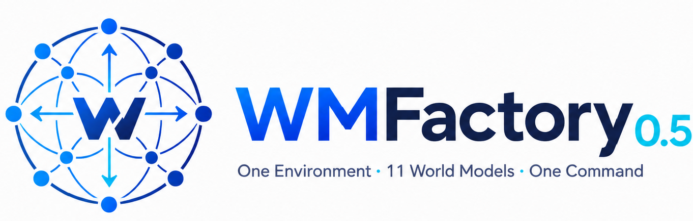
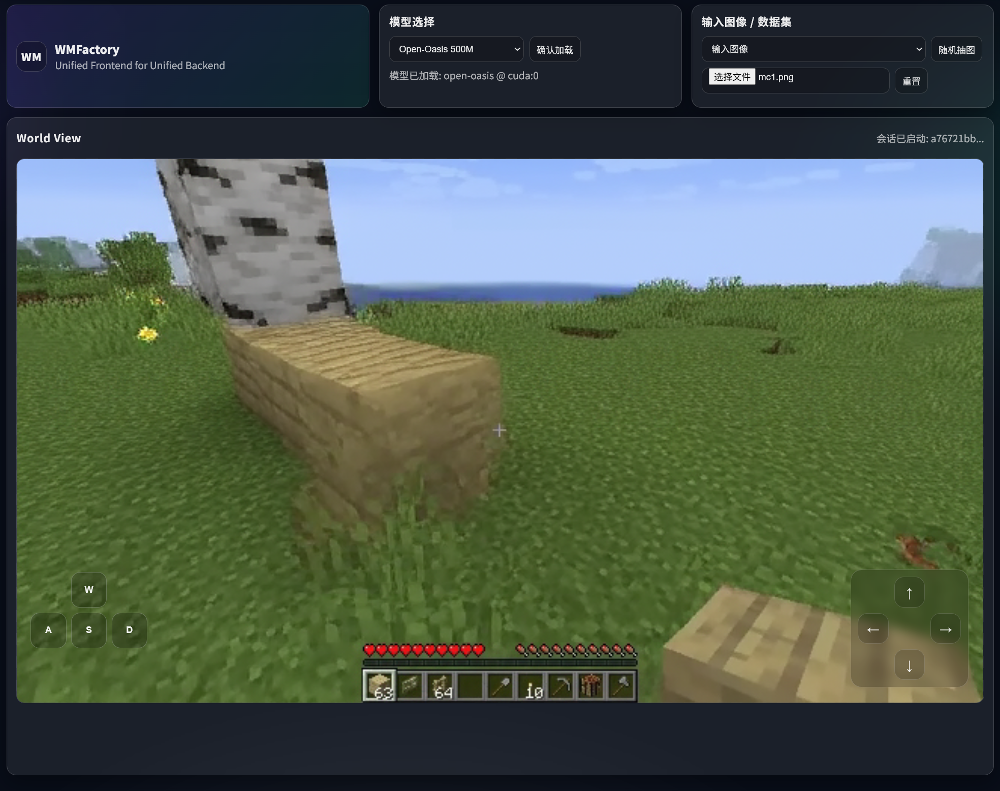

# WMFactory 0.5

<p align="center">
  <a href="https://github.com/Rising0321/WMFactory"></a>
  &nbsp;
  <a href="https://github.com/Rising0321/WMFactory/stargazers"></a>
  &nbsp;
  <a href="https://github.com/Rising0321/WMFactory/issues"></a>
  &nbsp;
  
  &nbsp;
  
</p>

<p align="center">

</p>

<p align="center"><strong>One environment · One procedure · Eleven interactive world models.</strong></p>

`WMFactory 0.5` is a major update of the WMFactory project. Its main goal is to remove the old per-model environment fragmentation and replace it with a single backend, a single shared runtime environment, and a single serving interface for many different world models.

## ✨ Project Goal

This repository is built around one practical promise:

- 📦 **1 shared environment**
- 🚪 **1 backend entrypoint**
- 🔌 **1 consistent session API**
- 🎮 **11 different interactive world models**

The focus is not to force every model into the same architecture. The focus is to make them usable from one unified system.


## 🧩 Unified Environment

The backend is designed around one shared Python environment.

Recommended stack:

- 🐍 Python `3.12`
- 🔥 PyTorch `2.9.0`
- 🤗 Transformers `4.57.3`
- 🎨 Diffusers `0.37.1`

Recommended install(Make sure the python version is 3.12):

```bash
python -m pip install -r requirements.txt
```

`flash-attn` is required. If the normal pip install fails, install the matching Dao-AILab wheel manually, then continue.

## 🚀 Quick Start

### Start the backend

```bash
cd WMBackend
python serve.py
```


### Full rollout regression:

We strongly recommend new users to run the full rollout regression and understand the procedure of the backend.

```bash
cd WMBackend
PYTHONNOUSERSITE=1 python scripts/verify_action_sweep_outputs.py
```

Each successful model rollout writes results into `WMBackend/testOutput/<model>/`.

### Load one model

```bash
curl -X POST http://127.0.0.1:9100/models/load \
  -H 'Content-Type: application/json' \
  -d '{"model_id":"matrixgame"}'
```

### Start a session

```bash
curl -X POST http://127.0.0.1:9100/sessions/start \
  -H 'Content-Type: application/json' \
  -d '{"model_id":"matrixgame","init_image_base64":"data:image/png;base64,..."}'
```

### Step the world

```bash
curl -X POST http://127.0.0.1:9100/sessions/step \
  -H 'Content-Type: application/json' \
  -d '{"session_id":"<session-id>","action":{"w":true}}'
```

Common action examples:

- ⬆️ forward: `{"w": true}`
- ⬅️ left: `{"a": true}`
- ➡️ right: `{"d": true}`
- 🔼 camera up: `{"camera_dy": -1.0}`
- ▶️ camera right: `{"camera_dx": 1.0}`

The transport format is unified. Exact action semantics remain model-specific.

## 📚 Supported Models

The current backend covers eleven models.

| Model | Upstream Repository | 
| --- | --- | 
| `matrixgame` (Matrix-Game 2.0) | `https://github.com/SkyworkAI/Matrix-Game` | 
| `matrixgame3` (Matrix-Game 3.0) | `https://github.com/SkyworkAI/Matrix-Game-3.0` | 
| `yume` (YUME 1.5) | `https://github.com/stdstu12/YUME` | 
| `diamond` | `https://github.com/eloialonso/diamond` |
| `open-oasis` | `https://github.com/etched-ai/open-oasis` |
| `wham` | `https://huggingface.co/microsoft/wham` |
| `vid2world` | `https://github.com/thuml/Vid2World` |
| `infinite-world` | `https://github.com/MeiGen-AI/Infinite-World` |
| `worldplay` (HY-WorldPlay 5B) | `https://github.com/Tencent-Hunyuan/HY-WorldPlay` |
| `mineworld` | `https://github.com/microsoft/mineworld` |
| `lingbot-world-fast` | `https://github.com/robbyant/lingbot-world` |


## 💾 Model Checkpoints

The model checkpoints must be stored in `WMBackend/checkpoints/<model>/`.

See `WMBackend/checkpointTree.md` for the on-disk layout and a folder tree.


## 🖥️ Unified Frontend

<p align="center">

</p>

For convenience, we provide a unified frontend that you can use WASD and ↑↓←→ to use 11 different interactive world models. You can start the frontend as follow:

```bash
cd WMFactory/frontend
python -m uvicorn server:app --host 0.0.0.0 --port 8080
```

Open `http://127.0.0.1:8080` in a browser.

Remember to start the backend before starting the frontend.

```bash
cd WMBackend
python serve.py
```

## 🙏 Acknowledgments

The unified backend design is inspired by [vLLM](https://github.com/vllm-project/vllm), adapted here for interactive world models rather than LLM token serving.

The implementation also builds on [nano-vllm-omni](https://github.com/Rising0321/nano-vllm-omni) and related discussion around unified multimodal runtime design.

The author of [OpenWorldLib](https://github.com/OpenDCAI/OpenWorldLib) for the discussion and inspiration.
