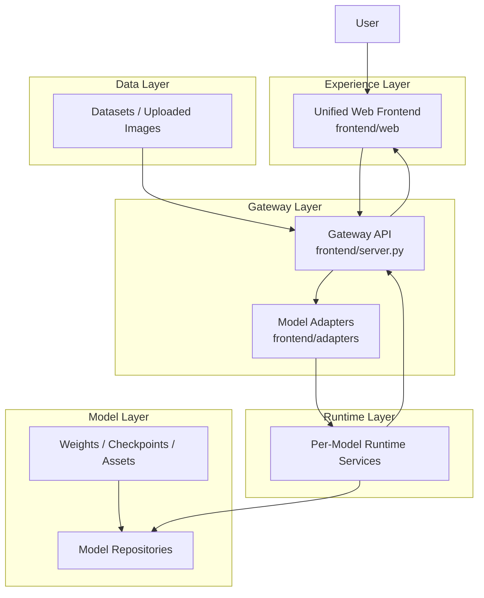

# Unified Operator on Interactive World Model

<p align="center">
  <a href="https://www.youtube.com/watch?v=loq5VTAmgeo">
    
  </a>
</p>

<p align="center">
  <a href="https://www.youtube.com/watch?v=loq5VTAmgeo"><strong>Watch Demo Video on YouTube</strong></a>
</p>

**One frontend. Many world models. One place to compare how interactive worlds actually feel.**

Unified Operator on Interactive World Model is an attempt to build a shared interface layer for a new class of generative systems: models that do not just produce videos, but produce a world you can enter, steer, and evaluate.

In this project, a "World Model" means a model in the spirit of Genie-style interactive generation, HunyuanWorld, World Labs, or Vid2World: you provide an image or text prompt, then interact with the generated world through movement and camera control. The ambition here is simple:

- choose a model
- choose a dataset image or upload your own image
- enter the world
- move with `WASD`
- look around by dragging
- compare different world models under one consistent interface

That makes this repo both a product surface and an evaluation surface. In the same way that arena-style systems made LLM comparison intuitive, this project aims to make interactive world-model comparison legible to both researchers and normal users.


## Supported Models and Services

The repo already contains service wrappers and adapter surfaces for the following model families:

| Model | Upstream |
| --- | --- |
| WorldFM | [inspatio/worldfm](https://github.com/inspatio/worldfm) |
| Infinite-World | [MeiGen-AI/Infinite-World](https://github.com/MeiGen-AI/Infinite-World) |
| LingBot-World | [Robbyant/lingbot-world](https://github.com/Robbyant/lingbot-world) |
| YUME | [stdstu12/YUME](https://github.com/stdstu12/YUME) |
| HY-WorldPlay | [Tencent-Hunyuan/HY-WorldPlay](https://github.com/Tencent-Hunyuan/HY-WorldPlay) |
| Hunyuan-GameCraft-1.0 | [Tencent-Hunyuan/Hunyuan-GameCraft-1.0](https://github.com/Tencent-Hunyuan/Hunyuan-GameCraft-1.0) |
| Matrix-Game | [SkyworkAI/Matrix-Game](https://github.com/SkyworkAI/Matrix-Game) |
| Vid2World | [thuml/Vid2World](https://github.com/thuml/Vid2World) |
| MineWorld | [microsoft/mineworld](https://github.com/microsoft/mineworld) |
| WHAM | [microsoft/wham](https://huggingface.co/microsoft/wham) |
| Open-Oasis | [etched-ai/open-oasis](https://github.com/etched-ai/open-oasis) |
| Diamond | [eloialonso/diamond](https://github.com/eloialonso/diamond) |

The project is deliberately structured so new world models can be plugged in without redesigning the frontend.


## Why This Project Exists

Most world-model papers and releases still ship with isolated demos, custom launch scripts, custom controls, and incompatible runtime assumptions.

That makes three things unnecessarily hard:

1. comparing different models under the same interaction protocol
2. turning research prototypes into something people can actually try
3. building a reusable benchmark surface for interactive world generation

This repo solves that by treating the frontend as a stable contract and every model as an adapter-backed runtime.

## What Makes It Unified

- The frontend talks to one API, not to individual model codebases.
- Each model runs in its own environment or service.
- Adapters translate one shared interaction schema into model-specific runtime calls.
- The user experience stays stable even when the backends are completely different.

## Unified Interaction Contract

The frontend is built around a consistent interaction loop:

- `GET /api/models`
- `POST /api/models/load`
- `POST /api/sessions/start`
- `POST /api/sessions/step`
- `POST /api/sessions/reset`

Each model adapter implements the same abstract shape:

```python
class WorldModelAdapter(ABC):
    model_id: str
    def load(self): ...
    def start_session(self, init_image_bytes): ...
    def reset_session(self, init_image_bytes): ...
    def step(self, action): ...
```

And each runtime returns the same core frame payload:

- `frame_base64`
- `reward`
- `ended`
- `truncated`
- `extra`

That is the heart of the project: one interaction language, many model implementations.

## Current Repo Layout

```text
WMFactory
├── data/        # datasets and image sources
├── models/      # local model repos and integration targets
├── frontend/    # unified web frontend + gateway server
├── services/    # per-model runtime services
├── utils/       # shared utilities
└── changeLog/   # local diffs against model origins
```

## Frontend Design Goal

The frontend is not meant to be just another paper demo.

It is meant to become:

- a unified launcher for interactive world models
- a shared human evaluation surface
- a reusable integration target for future models
- a bridge between model release code and actual user experience

## Supported Integration Pattern

The recommended path for every new model is:

1. keep the web UI unchanged
2. add a dedicated service under `services/`
3. add a gateway adapter under `frontend/adapters/`
4. map the shared action schema into the model's own action space

This avoids dependency conflicts, keeps environments isolated, and preserves one stable frontend.

## Quick Start

Run the gateway from the frontend directory:

```bash
cd frontend
python -m uvicorn server:app --host 0.0.0.0 --port 8081
```

Then open the web app, select a model, select or upload an image, and start stepping through the generated world.

## Controls

- `W / A / S / D`: movement
- drag mouse: camera control


## Research Use Case

This project is especially useful if you care about questions like:

- Which world model feels most controllable under the same interface?
- Which model preserves scene identity after repeated actions?
- Which model breaks first under long-horizon interaction?
- How should we benchmark world generation beyond offline videos?

This is why the frontend matters. It is not decoration. It is the evaluation instrument.


## Demos

GitHub README rendering does not reliably inline local `mp4` playback, so the demo videos are linked as preview files:

| Demo | Preview |
| --- | --- |
| World | [Open preview](./assets/2_worldfm.mp4) |
| MatrixWorld | [Open preview](./assets/6_MatrixGame.mp4) |
| Diamond | [Open preview](./assets/1_diamond.mp4) |

## System Architecture




## To Do List

### 1. Evolve Into an Arena-Style Evaluation Platform

The long-term goal is to push this project beyond a multi-model demo site and toward a fair comparison platform in the spirit of LLM Arena.

The ideal future interaction would be:

- users play two anonymous world models
- both models receive the same input condition
- both models are evaluated through the same control protocol
- users decide which world they prefer

If this becomes reliable and widely adopted, the platform can do more than host demos. It can become a public benchmark surface and potentially help define a standard interface for interactive world models.

### 2. Connect More Models, Including Non-Open Models

At the moment, the platform mainly supports open-source world models. A major development direction is to support more external and heterogeneous model providers.

This includes:

- hosted inference endpoints
- closed-source model APIs
- proprietary runtimes wrapped through adapters
- service bridges that preserve the same frontend contract

The core challenge is not only connecting more systems, but keeping them all inside one unified interaction protocol.

### 3. Support Richer Action Spaces

The current platform already supports a useful core interaction loop centered on movement and camera control, but future versions should support a broader set of actions.

That includes:

- more detailed movement primitives
- more game-like discrete controls
- richer interaction actions beyond navigation
- model-specific action mappings under the same frontend abstraction

The goal is to increase expressiveness without losing the simplicity of the unified interface.

## Notes

- `models/` stores local model repos and may differ from the original upstreams.
- `changeLog/` records what changed relative to model origins.
- large local outputs, caches, checkpoints, and datasets are intentionally ignored by Git.

## Citation / Credit

This project stands on top of many excellent model repos from the world-model ecosystem. The purpose here is not to replace them, but to give them a common interaction surface.

Special thanks to the authors of [OpenWorldLib](https://github.com/OpenDCAI/OpenWorldLib) for their work and for the discussions that helped shape this project.

If you are building interactive world models and want a unified frontend target, this repo is exactly that direction.

```bibtex
@misc{wmfactory,
  title  = {WMFactory: World Model Unified Frontend},
  author = {Ruixing Zhang},
  year   = {2026},
  url    = {https://github.com/Rising0321/WMFactory}
}
```
